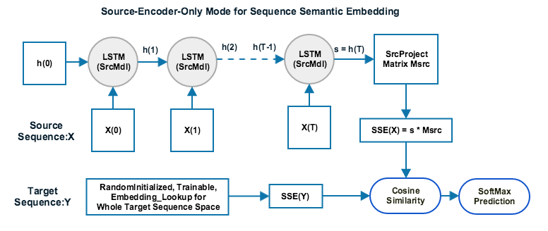
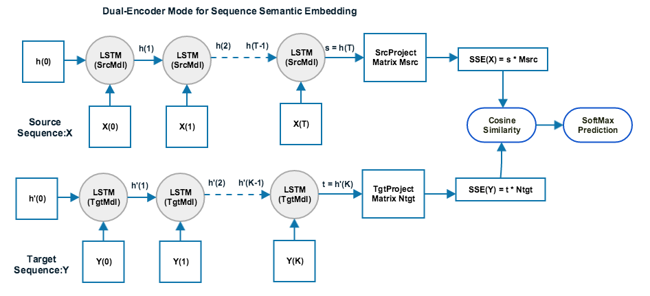
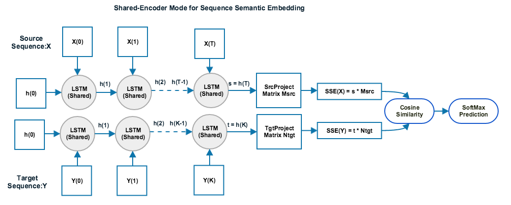

# Sequence-Semantic-Embedding

SSE(Sequence Semantic Embedding) is an encoder framework toolkit for NLP related tasks and it's implemented in TensorFlow by leveraging TF's convenient DNN/CNN/RNN/LSTM etc. building blocks. SSE model translates a sequence of symbols into a vector of numeric numbers, so that different sequences with similar semantic meanings will have closer numeric vector distances. This numeric number vector is called the SSE for the original sequence of symbols.

This repo includes a SSE model training/testing pipeline, a Flask based RESTful webserver to load and inference trained models for runtime requests, and a small sample train/eval dataset for clothes/shoes/accessaries category classification task.

SSE can be applied to some large scale NLP related machine learning tasks. For example, it can be applied to large scale classification task: mapping a listing title or search query to one of the 20,000+ leaf categories in eBay website. Or it can be applied to information retrieval task: mapping a search query to some most relevant documents in the inventory. Or it can be applied to question answering task: mapping a question to a most suitable answers. 

Depending on each specific task, similar semantic meanings can have different definitions. For example, in a classification task, similar semantic meanings means that for each correct pair of (listing-title, category), the SSE of title is close to the SSE of corresponding category.  While in an information retrieval task, similar semantic meaning means for each relevant pair of (query, document), the SSE of query is close to the SSE of relevant document.  

For more details about the theory behind deep learning for NLP related tasks and related Tensorflow tutorials, please refer to below published references.

## Contents

| __Folder Name__ | __Description__ |
|---|---|
| `rawdata`         | Example data folder for classification task. Contains training pairs, evaluation pairs and full space target classes. |
| `sse_main.py`     | SSE main program for training and evaluation tasks. |
| `sse_model.py`    | SSE model class for training and inference. |
| `sse_evaluator.py`| SSE model accuracy evaluator. |
| `env_setup.sh`    | Scripts to install dependencies such as python, tensorflow automatically.|
| `config`    | configuration folder contains requirements for different OS and devices.|
| `webserver.py`   | RESTful webserver to load trained TF models and serving run-time requests.  |


## Setup Instructions

### Install Dependences

Just issue below env_setup.sh. Depend on your current systems configuration, you might need to modify this script a little bit to suit for your own situation. The env_setup.sh script is quite strait forward. 

``` bash
$> ./env_setup.sh

```


### Train SSE Models

SSE encoder framework supports three different types of network configuration modes: source-encoder-only, dual-encoder and shared-encoder. 

* In source-encoder-only mode, SSE will only train a single encoder model(RNN/LSTM/CNN) for source sequence. For target sequence, SSE will just learn its sequence embedding directly without applying any encoder models. This mode is suitable for closed target space tasks such as classification task, since in such tasks the target sequence space is limited and closed thus it does not require to generate new embeddings for any future unknown target sequences outside of training stage. A sample network config diagram is shown as below:
    


* In dual-encoder mode, SSE will train two different encoder models(RNN/LSTM/CNN) for both source sequence and target sequence. This mode is suitable for open target space tasks such as information retrieval, since the target sequence space in those tasks is open and dynamically changing, a specific target sequence encoder model is needed to generate embeddings for new unobserved target sequence outside of training stage. A sample network config diagram is shown as below:
    


* In shared-encoder mode, SSE will train one single encoder model(RNN/LSTM/CNN) shared for both source sequence and target sequence. This mode is suitable for open target space tasks such as question answering system or information retrieval system, since the target sequence space in those tasks is open and dynamically changing, a specific target sequence encoder model is needed to generate embeddings for new unobserved target sequence outside of training stage. In shared-encoder mode, the source sequence encoder model is the same as target sequence encoder mode. Thus this mode is better for tasks where the vocabulary between source sequence and target sequence are similar and can be shared. A sample network config diagram is shown as below:
    

To start training your models, you can simply just issue below command:

``` bash
$> python sse_main.py

```

Above script will use the default dataset stored in rawdata folder to train SSE encoder models. By default, source-encoder-only mode is used. And after every 200 batches, checkpoint will save a model to default models folder.

The default rawdata folder contains a zipped sample dataset. This dataset contains TAB seperated training/evaluation pairs with the format of (SourceSeq, TargetSequence, TargetID). It also contains a list of full target space ID file in the format of (targetID targetSequence).

If the models folder contain some data and models already left over from previous training experiments, the above command can pickup previous trained models to continue training process instead of starting over everything from scratch.

You can also override some default parameters for the model training process by supplying parameters such as --data_dir, --model_dir, --network_mode, --learning_rate, --learning_rate_decay_factor, --batch_size, --embedding_size, --num_layers, --src_vocab_size, --tgt_vocab_size, --steps_per_checkpoint, etc. Please check the source code in sse_main.py for more details.


### Visualize Training progress in Tensor Board

``` bash
$> tensorboard --logdir=models

```

### Predict a target class for a supplied input sequence 

``` bash
$> python sse_main.py --demo=True

```

### Start RESTful webserver to load pre-trained TF models and serve run-time requests

``` bash
$> export FLASK_APP=webserver.py
$> python -m flask run --port 5000 --host=0.0.0.0

```

### Call WebService to get prediction results

``` bash
$> curl -i -H "Accept: application/json" -H "Content-Type: application/json" -X GET http://hostname:5000/api/catreco?title=men's running shoes

or you can just open a web browser and put a GET request like: http://hostname:5000/api/catreco?title=men's running shoes&nbest=15 

The webserver will return json object with a list of top 15 most relevant eBay leaf category with ID, names and matching scores.

```


## References
More detailed information about the theory and practice for deep learning(DNN/CNN/LSTM/RNN etc.) in NLP area can be found in papers and tutorials as below:

 * [ Deep Learning for Natural Language Processing: Theory and Practice (Tutorial) ] (https://www.microsoft.com/en-us/research/wp-content/uploads/2016/02/CIKM14_tutorial_HeGaoDeng.pdf)
 * [ Learning Semantic Representations Using Convolutional Neural Networks for Web Search ] (https://www.microsoft.com/en-us/research/publication/learning-semantic-representations-using-convolutional-neural-networks-for-web-search/)
 * [ Deep Sentence Embedding Using LSTM Networks: Analysis and Application to Information Retrieval ] (http://arxiv.org/abs/1502.06922)
 * [ Sequence to Sequence Learning with Neural Networks ] (http://arxiv.org/abs/1409.3215)
 * [ Neural Machine Translation by Jointly Learning to Align and Translate ] (http://arxiv.org/abs/1409.0473)
 * [ On Using Very Large Target Vocabulary for Neural Machine Translation ] (http://arxiv.org/abs/1412.2007)
 * [ Tensorflow's Machine Translation Implementation based on Seq2Seq model ] (https://github.com/tensorflow/tensorflow/blob/master/tensorflow/models/rnn/translate)